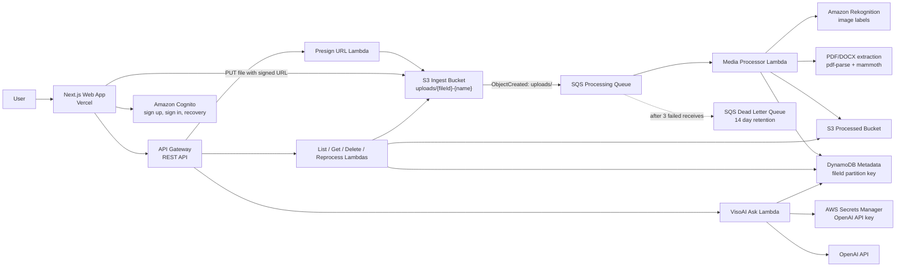

# MandVision

MandVision is a serverless file intelligence platform for uploading images, PDFs, DOC, and DOCX files, processing them asynchronously, and turning the results into searchable analytics and conversational answers.

The app is built as a production-inspired AWS event-driven pipeline with a Next.js frontend, pre-signed S3 uploads, SQS-backed processing, DynamoDB metadata storage, Cognito authentication, and a document-aware assistant called VisoAI.

[Live app](https://mandvision.vercel.app)

## Product Preview

| Dashboard | Upload Flow | VisoAI |
| --- | --- | --- |
|  |  |  |

## What It Does

- Upload images and documents directly from the browser using secure pre-signed S3 URLs.
- Process uploads asynchronously after S3 object-created events.
- Detect image labels with Amazon Rekognition.
- Extract searchable text from PDFs and DOCX files.
- Store upload status, metadata, labels, document text, previews, and insights in DynamoDB.
- Manage uploaded files with search, filters, favorites, CSV export, preview, reprocess, and delete actions.
- Ask VisoAI questions about MandVision or scoped processed documents.
- Support public demo analytics first, then user-specific dashboard behavior after authentication.

## Architecture




## Processing Flow

1. The browser requests an upload URL from API Gateway.
2. A Lambda returns a pre-signed S3 PUT URL with a generated `fileId`.
3. The browser uploads the file directly to S3, keeping file bytes out of the web server.
4. S3 publishes an object-created notification for the `uploads/` prefix.
5. SQS buffers the event and invokes the media processor Lambda in batches.
6. The processor detects whether the file is an image or document.
7. Images are analyzed with Rekognition. PDFs and DOCX files are converted into searchable text.
8. Processing results are written to DynamoDB under the same `fileId`.
9. The frontend refreshes the library, dashboard analytics, previews, and VisoAI context from the stored metadata.

## Design Decisions

### Direct-to-S3 Uploads

MandVision uses pre-signed S3 URLs so the browser uploads files directly to AWS. This keeps large file payloads away from the Next.js app and API Lambda, reduces timeout risk, and makes upload capacity mostly an S3 concern instead of an application-server concern.

### SQS Before Processing Lambda

S3 events can arrive in bursts. SQS sits between S3 and the processor Lambda to absorb spikes, provide retry control, and avoid losing work if the processor fails temporarily. The queue uses a 60 second visibility timeout, 4 day retention, and a dead letter queue after 3 failed receives.

### DynamoDB Idempotency Boundary

Each upload gets a `fileId` before it reaches S3. The object key includes that ID, and the processor stores the final metadata using `fileId` as the DynamoDB partition key. If the same event is processed again, it updates the same logical media item instead of creating duplicate records.

### Focused Lambdas

The backend is split into small Lambdas for upload URLs, listing media, fetching details, deleting media, reprocessing, preview URLs, and VisoAI. This keeps each function easier to reason about and gives each one a narrower IAM permission set.

### VisoAI Document Scope

VisoAI can answer normal questions about MandVision, but document answers are scoped to processed documents. Empty document selection does not fall back to global demo documents, which prevents a signed-in user from accidentally seeing public sample context.

### Where Step Functions Fits Next

The current pipeline is intentionally simple: S3, SQS, one processor Lambda, and DynamoDB. Step Functions becomes useful when the processing path grows into multiple long-running stages, such as async Textract jobs, thumbnail generation, human review, retries per stage, or branching workflows for different file types. For the current version, SQS plus one processor Lambda is cheaper and easier to operate.

## Failure Handling

- SQS retries failed processing events automatically.
- After 3 failed receives, events move to the DLQ for inspection.
- Processor errors are written back to DynamoDB with `FAILED` status when possible.
- The frontend exposes retry/reprocess actions for items that need attention.
- Secrets such as the OpenAI API key are loaded from AWS Secrets Manager instead of the frontend.

## Cost At Scale

MandVision is designed to have low idle cost. Most cost grows with usage:

- S3: object storage plus PUT/GET requests.
- Lambda: processing duration per upload and API request volume.
- SQS: request volume for queued processing events.
- DynamoDB: on-demand reads and writes for metadata and history.
- Rekognition: image analysis calls.
- OpenAI: VisoAI questions over processed document context.
- Vercel: frontend hosting and builds.

For demo or portfolio traffic, the largest variable costs are usually Rekognition calls, OpenAI usage, and stored files. At higher volume, the main scaling lever is to control file size, processing concurrency, document extraction limits, and VisoAI context size.

## Security Notes

- S3 buckets block public access and use managed encryption.
- Upload URLs are short-lived pre-signed URLs.
- Cognito handles sign up, sign in, email verification, and account recovery.
- API credentials are not exposed to the browser.
- The OpenAI API key is stored in AWS Secrets Manager.
- Uploaded media is referenced through generated IDs rather than trusting raw filenames.

## Tech Stack

- TypeScript
- Next.js
- AWS CDK
- Amazon API Gateway
- AWS Lambda
- Amazon S3
- Amazon SQS
- Amazon DynamoDB
- Amazon Rekognition
- Amazon Cognito
- AWS Secrets Manager
- OpenAI API
- Vercel

## Local Development

Install dependencies:

```bash
npm install
```

Run the web app:

```bash
npm run dev:web
```

Common frontend environment variables:

```bash
NEXT_PUBLIC_API_URL=your_api_gateway_url
NEXT_PUBLIC_AWS_REGION=us-east-1
NEXT_PUBLIC_COGNITO_USER_POOL_CLIENT_ID=your_cognito_app_client_id
NEXT_PUBLIC_WEBSOCKET_URL=optional_websocket_url
```

Deploy infrastructure:

```bash
npm run deploy
```

Build the web app:

```bash
npm run build:web
```

## Repository Structure

```text
apps/web/                 Next.js frontend
infra/                    AWS CDK stacks
services/presign-url/     Pre-signed upload URL Lambda
services/media-processor/ SQS-driven media processor Lambda
services/list-media/      Media library API Lambda
services/get-media/       Media detail API Lambda
services/delete-media/    S3 and DynamoDB delete Lambda
services/reprocess-media/ Manual reprocess Lambda
services/ask-document/    VisoAI document assistant Lambda
docs/screenshots/         README screenshots
```

## Roadmap

- Use async Textract for scanned PDFs and multi-page OCR.
- Add Step Functions when processing becomes a multi-stage workflow.
- Add stronger backend tenant isolation with user-scoped keys or indexes.
- Add CloudWatch alarms for DLQ depth and processor failures.
- Add end-to-end tests for upload, processing, delete, and VisoAI flows.
