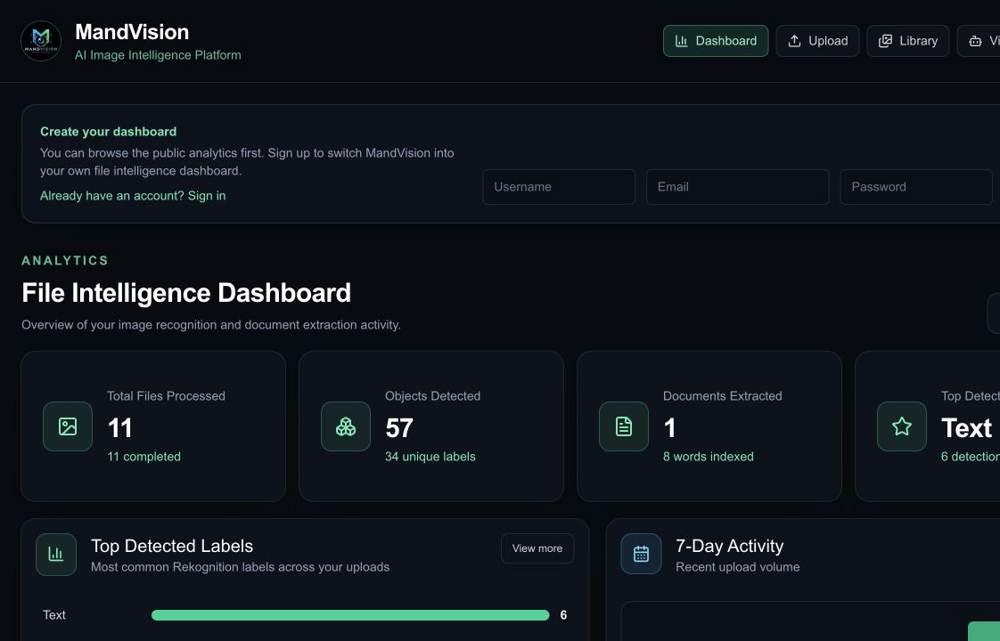
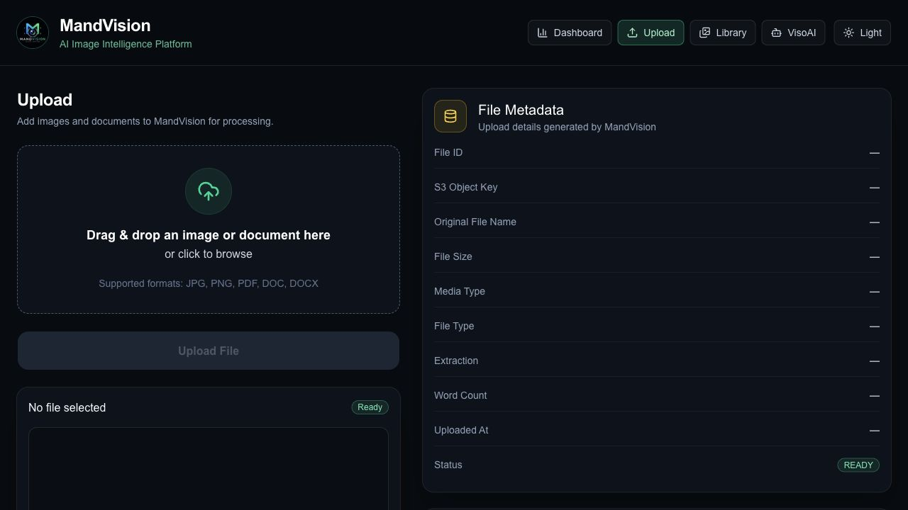
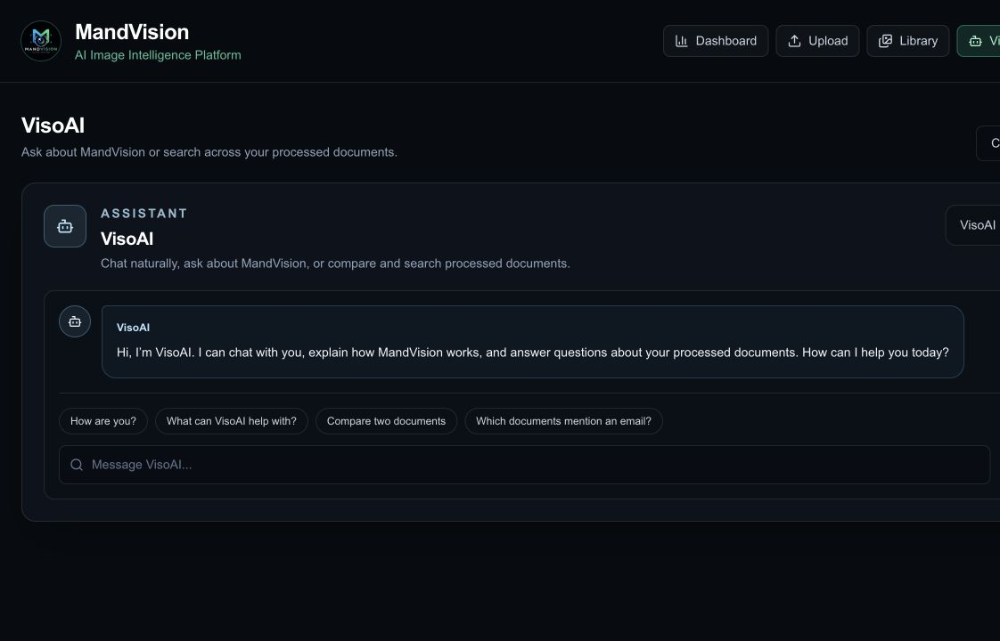
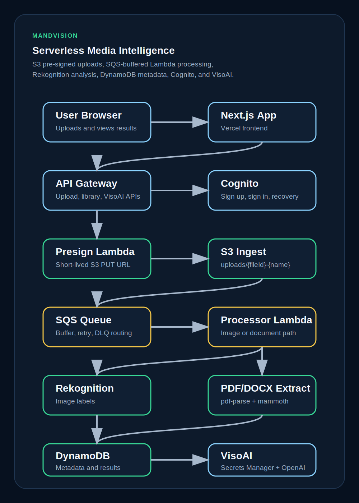
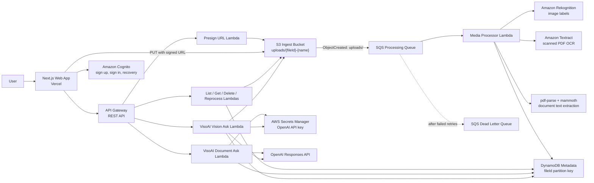

# MandVision

MandVision is an AI-powered file intelligence platform for reviewing images, PDFs, DOC, and DOCX files. It lets a user upload evidence-style media, detect visible objects, extract document text, and ask VisoAI natural questions about the selected file.

Live app: [mandvision.vercel.app](https://mandvision.vercel.app)

## Current Highlights

- Real VisoAI assistant backed by the OpenAI Responses API.
- Vision chat for selected images using the uploaded image plus Rekognition labels as context.
- Document Q&A over extracted PDF/DOCX text.
- OCR fallback for scanned PDFs using Amazon Textract.
- Guest demo sessions with a 5-upload limit.
- Signed-in workspaces scoped to the authenticated user.
- Library-first review flow with preview, search, filters, favorites, CSV export, delete, and reprocess actions.
- Production deployment on Vercel with AWS serverless infrastructure.

## July 11, 2026 Updates

- Connected image chat to a real LLM so VisoAI can answer conversational questions about selected images instead of only repeating labels.
- Added `/vision/ask`, a new API endpoint that sends selected image context to OpenAI through an AWS Lambda.
- Stored and loaded the OpenAI API key from AWS Secrets Manager.
- Added markdown rendering for VisoAI responses.
- Fixed image prompt routing so selected-image questions always go to VisoAI before local helper responses.
- Added guest session isolation and limited guests to 5 uploads.
- Removed upload controls from the Library page so Library is focused on review.
- Added Textract OCR fallback for scanned/image-based PDFs.
- Reprocessed a scanned PDF successfully from `EMPTY / 0 words` to `COMPLETE / 170 words`.
- Enabled document reprocessing for empty or failed document extraction.
- Updated production deployments for AWS API, AWS processing Lambdas, and Vercel.

## Product Preview

| Dashboard | Upload Flow | VisoAI |
| --- | --- | --- |
|  |  |  |

## What It Does

MandVision is built around a simple workflow:

1. Upload an image or document.
2. Let the backend process it asynchronously.
3. Open the item in Library.
4. Review extracted labels, OCR text, metadata, and structured details.
5. Ask VisoAI targeted questions about the selected file.

Supported uploads:

- JPG
- PNG
- PDF
- DOC
- DOCX

Image features:

- Detects visible objects with Amazon Rekognition.
- Stores labels and confidence scores.
- Lets VisoAI answer natural questions about the selected image.
- Uses the image itself for LLM vision analysis, not just label matching.

Document features:

- Extracts embedded text from PDFs.
- Falls back to Textract OCR for scanned PDFs.
- Extracts raw text from DOCX files.
- Detects useful structured details such as emails, dates, amounts, phone numbers, and identifiers.
- Lets VisoAI summarize and answer questions over processed document text.

Library features:

- Search by filename, label, or extracted document text.
- Filter by media type, status, extraction state, and favorites.
- Preview selected files.
- Download originals and extracted text.
- Export CSV metadata.
- Reprocess failed, pending, or empty-extraction files.
- Delete uploads from storage and history.

## Architecture





## Processing Flow

1. The browser requests an upload URL from API Gateway.
2. The presign Lambda creates a `fileId`, validates guest upload limits, and returns a short-lived S3 upload URL.
3. The browser uploads the file directly to S3.
4. S3 publishes an object-created event for the `uploads/` prefix.
5. SQS buffers the event and invokes the media processor Lambda.
6. The processor determines whether the file is an image or document.
7. Images are analyzed with Rekognition.
8. PDFs are parsed for embedded text; if empty, Textract OCR is used.
9. DOCX files are extracted with Mammoth.
10. Metadata, status, labels, text, previews, insights, and errors are stored in DynamoDB.
11. The frontend refreshes Library and VisoAI context from stored metadata.

## VisoAI

VisoAI is the assistant layer for MandVision.

For images, VisoAI receives:

- The selected uploaded image through a signed S3 URL.
- Rekognition labels as supporting context.
- The user’s question.

For documents, VisoAI receives:

- The selected or scoped document text.
- Detected document insights.
- Source filenames for attribution.
- The user’s question.

VisoAI answers in markdown and is designed to be conversational, but scoped. It should answer from the selected user file rather than unrelated public/demo context.

## Guest And User Sessions

MandVision supports both guest demos and signed-in users.

- Guests get a temporary session stored in browser session storage.
- Guest uploads are scoped to that temporary session.
- Guests are limited to 5 uploads.
- Signed-in users can keep a persistent workspace tied to their account.
- Signed-in uploads are separated from guest uploads and from other users.

## Design Decisions

### Direct-to-S3 Uploads

MandVision uses pre-signed S3 URLs so files go directly from the browser to S3. This avoids sending file bytes through the Next.js app or API Lambda, reducing timeout risk and keeping upload handling serverless.

### SQS Before Processing

S3 upload events are routed through SQS before Lambda processing. This gives the pipeline buffering, retries, and a dead letter queue instead of relying on a single direct invocation.

### DynamoDB As The Media Index

Each upload receives a generated `fileId`. The file ID is included in the S3 object key and used as the DynamoDB partition key, so repeated processing updates the same logical item.

### Small Lambdas

The backend is split into focused functions:

- Presign upload URL
- List media
- Get media details
- Generate preview URLs
- Delete media
- Reprocess media
- Ask documents
- Ask images
- Process uploaded media

This keeps permissions narrower and each function easier to reason about.

### OCR Fallback

Some PDFs contain selectable embedded text, while others are scanned images. MandVision first tries regular PDF text extraction, then falls back to Textract OCR when the PDF text layer is empty.

## Failure Handling

- SQS retries failed processing events.
- Events move to a DLQ after repeated failed receives.
- Failed processing writes `FAILED` metadata when possible.
- Empty scanned PDFs can be repaired through Textract OCR.
- Library exposes reprocess actions for failed, pending, and empty document items.
- VisoAI falls back gracefully if OpenAI is unavailable.
- API secrets are loaded server-side from AWS Secrets Manager.

## Security Notes

- S3 buckets block public access.
- S3 buckets use managed encryption.
- Upload URLs are short-lived.
- Cognito handles signup, sign-in, verification, account recovery, and account state.
- OpenAI keys stay in AWS Secrets Manager.
- Browser code never receives API credentials.
- Guest and signed-in uploads are scoped before being shown in Library.

## Cost Notes

MandVision is designed for low idle cost. Most costs scale with usage:

- S3 storage and requests
- Lambda processing duration
- SQS requests
- DynamoDB reads and writes
- Rekognition image detection
- Textract OCR for scanned documents
- OpenAI VisoAI requests
- Vercel hosting/builds

The largest variable costs are usually Rekognition, Textract, OpenAI usage, and stored files.

## Tech Stack

- TypeScript
- Next.js
- AWS CDK
- Amazon API Gateway
- AWS Lambda
- Amazon S3
- Amazon SQS
- Amazon DynamoDB
- Amazon Rekognition
- Amazon Textract
- Amazon Cognito
- AWS Secrets Manager
- OpenAI Responses API
- Vercel

## Local Development

Install dependencies:

```bash
npm install
```

Run the web app:

```bash
npm run dev:web
```

Build the web app:

```bash
npm run build:web
```

Deploy infrastructure:

```bash
npm run deploy
```

Common frontend environment variables:

```bash
NEXT_PUBLIC_API_URL=your_api_gateway_url
NEXT_PUBLIC_AWS_REGION=us-east-1
NEXT_PUBLIC_COGNITO_USER_POOL_CLIENT_ID=your_cognito_app_client_id
NEXT_PUBLIC_WEBSOCKET_URL=optional_websocket_url
```

Backend OpenAI configuration:

```bash
OPENAI_API_KEY_SECRET_NAME=MandVision
OPENAI_MODEL=gpt-5.6
```

The default deployment expects the OpenAI API key to be available in AWS Secrets Manager.

## Repository Structure

```text
apps/web/                   Next.js frontend
infra/                      AWS CDK stacks
services/presign-url/       Pre-signed upload URL Lambda
services/media-processor/   SQS-driven media processor Lambda
services/list-media/        Media library API Lambda
services/get-media/         Media detail API Lambda
services/get-preview-url/   Signed preview URL Lambda
services/delete-media/      S3 and DynamoDB delete Lambda
services/reprocess-media/   Manual reprocess Lambda
services/ask-document/      VisoAI document Q&A Lambda
services/ask-vision/        VisoAI image/vision Q&A Lambda
docs/screenshots/           README screenshots
```

## Roadmap

- Add async Textract workflows for larger multi-page PDFs.
- Add Step Functions if processing grows into more long-running stages.
- Add stronger backend tenant isolation with user-scoped keys or secondary indexes.
- Add CloudWatch alarms for DLQ depth, OCR failures, and VisoAI errors.
- Add automated end-to-end tests for upload, processing, OCR, reprocess, delete, and VisoAI flows.
- Add richer case/evidence organization for security-review workflows.
