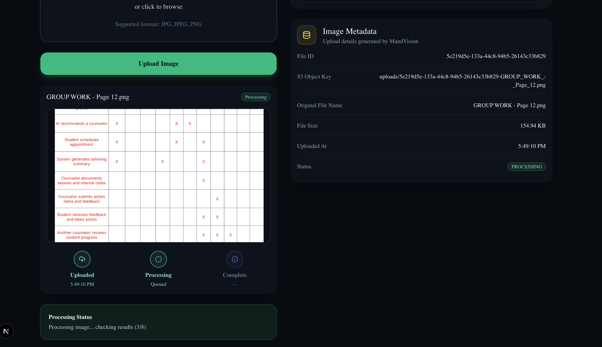
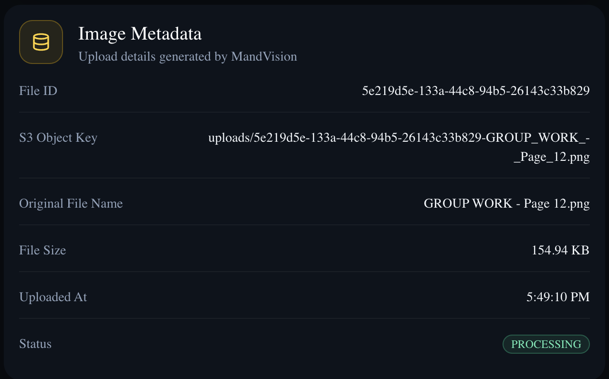
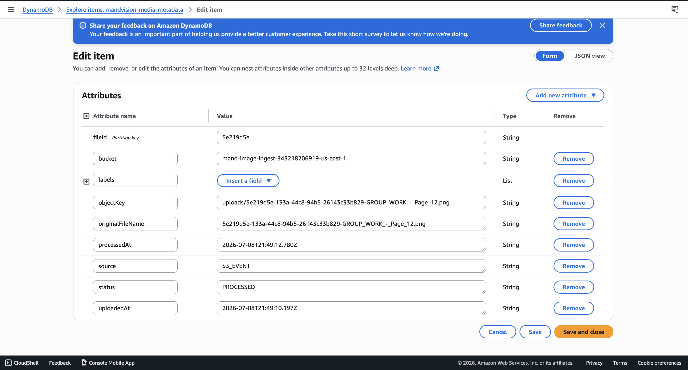
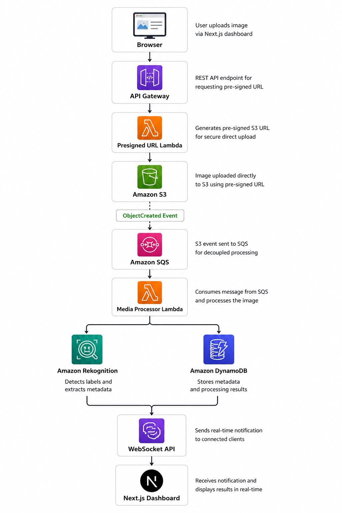

# MandVision
MandVision is a serverless, event-driven AI image processing platform built on AWS.
Users upload JPG/PNG images through a Next.js dashboard using secure pre-signed S3 URLs. Once uploaded, S3 events trigger an asynchronous processing pipeline powered by SQS, Lambda, Amazon Rekognition, DynamoDB, and WebSocket notifications.
## Architecture
```mermaid
flowchart TD
A[Next.js Frontend] --> B[API Gateway REST API]
    B --> C[Presign URL Lambda]
    C --> D[S3 Ingest Bucket]
    D --> E[S3 Object Created Event]
    E --> F[SQS Processing Queue]
    F --> G[Media Processor Lambda]
    G --> H[Amazon Rekognition]
    G --> I[DynamoDB Metadata Table]
    G --> J[API Gateway WebSocket API]
    J --> A
    A --> K[GET /media/{fileId}]
    K --> L[Get Media Lambda]
    L --> I
```

## AWS Services Used

- Amazon S3
- Amazon API Gateway (REST)
- Amazon API Gateway (WebSocket)
- AWS Lambda
- Amazon SQS
- Amazon DynamoDB
- Amazon Rekognition
- AWS CDK
- IAM
- CloudWatch

## Screenshots


---

## Upload in Progress



---

## Processing Results



---

## DynamoDB Metadata



---

## Architecture



---

## Future Enhancements

- Amazon Cognito authentication
- User-specific upload history
- Search images by detected labels
- Thumbnail generation
- Amazon Textract document support
- Step Functions workflow orchestration
- Email notifications with SNS/SES
- CloudFront + custom domain
- CI/CD with GitHub Actions
